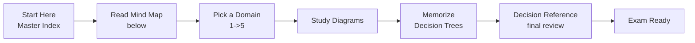
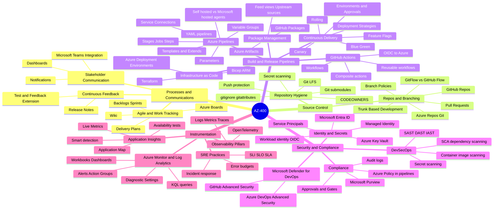
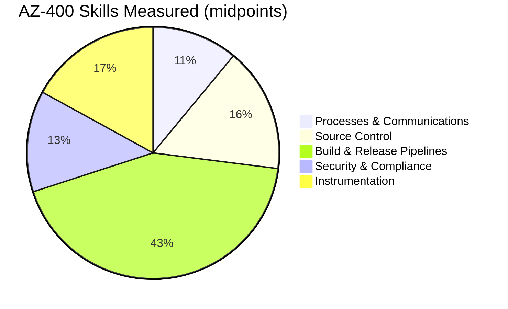
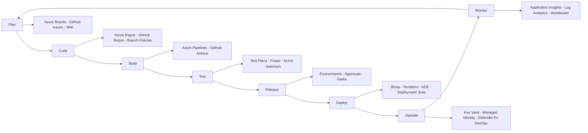
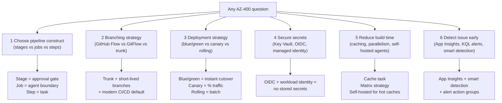
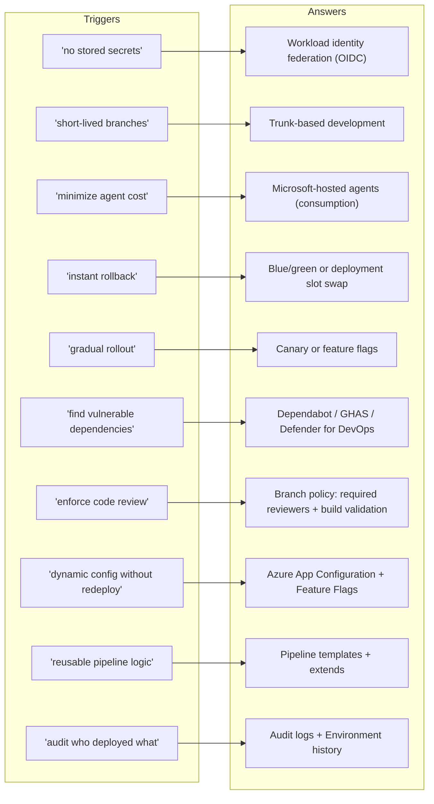

# AZ-400 Visual Study Guide - Master Index

> **Designing and Implementing Microsoft DevOps Solutions**
> Concept-only study aid built from the official Microsoft Learn skills measured. Diagrams, decision trees, and original summaries - no exam questions reproduced.

**Skills outline:** https://learn.microsoft.com/credentials/certifications/resources/study-guides/az-400

---

## How to use this guide

---

## The 5 Exam Domains - Mind Map

---

## Official Skills Weighting

| Slice | Weight | Jump to chapter |
| --- | --- | --- |
| Processes & Communications | **10-15%** | [01 Processes & Communications](01-processes-and-communications.md) |
| Source Control | **15-20%** | [02 Source Control](02-source-control.md) |
| Build & Release Pipelines | **40-45%** | [03 Build & Release Pipelines](03-build-and-release-pipelines.md) |
| Security & Compliance | **10-15%** | [04 Security & Compliance](04-security-and-compliance.md) |
| Instrumentation | **15-20%** | [05 Instrumentation](05-instrumentation.md) |

> **Pipelines is ~43% of the exam.** Spend half your study time there.

---

## DevOps lifecycle - service emphasis map

---

## The 6 Core Question Patterns in AZ-400

---

## The "Magic Words" Translator

---

## Domain files in this guide

| # | Domain | File | Focus |
|---|--------|------|-------|
| 1 | Processes & Communications | [01-processes-and-communications.md](01-processes-and-communications.md) | Boards, work tracking, dashboards, Teams |
| 2 | Source Control | [02-source-control.md](02-source-control.md) | Git, branching, PR policies, repo hygiene |
| 3 | Build & Release Pipelines | [03-build-and-release-pipelines.md](03-build-and-release-pipelines.md) | YAML, Actions, deployment strategies, IaC |
| 4 | Security & Compliance | [04-security-and-compliance.md](04-security-and-compliance.md) | DevSecOps, OIDC, Key Vault, Defender for DevOps |
| 5 | Instrumentation | [05-instrumentation.md](05-instrumentation.md) | App Insights, Log Analytics, KQL, SLI/SLO |
| | **Exam Decision Reference** | [05-exam-cheatsheet.md](05-exam-cheatsheet.md) | Decision trees + scenario keyword map |
| | **Concept & Reference Index** | [06-references.md](06-references.md) | Every concept linked to Microsoft Learn |
| + | **Extra Concepts** | [07-extra-az400-concepts.md](07-extra-az400-concepts.md) | Edge cases + DevOps philosophy |
| + | **Microsoft Learn Summaries** | [08-learn-summaries.md](08-learn-summaries.md) | Per-service overviews |
| + | **Architectures - AZ-400** | [09-arch-az400.md](09-arch-az400.md) | Reference DevOps architectures |

---

## Recommended study order (8 days)

```mermaid
gantt
    title Suggested 8-day plan
    dateFormat X
    axisFormat Day %d
    section Foundations
    Processes & Communications :a1, 0, 1d
    Source Control :a2, after a1, 1d
    section Pipelines (deepest)
    Build pipelines (CI) :b1, after a2, 1d
    Release pipelines (CD) :b2, after b1, 1d
    Deployment strategies + IaC :b3, after b2, 1d
    section Operations
    Security & Compliance :c1, after b3, 1d
    Instrumentation :c2, after c1, 1d
    section Final
    Decision reference + practice :d1, after c2, 1d
```

---

**Next:** open [01-processes-and-communications.md](01-processes-and-communications.md)
