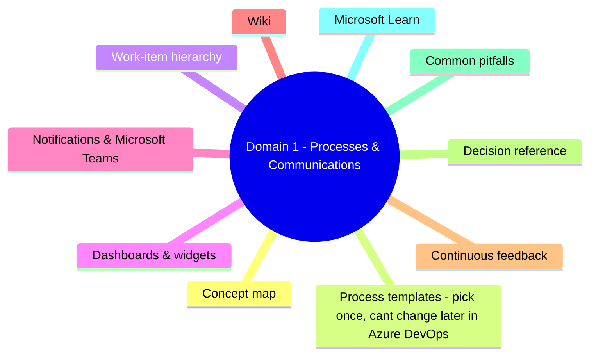
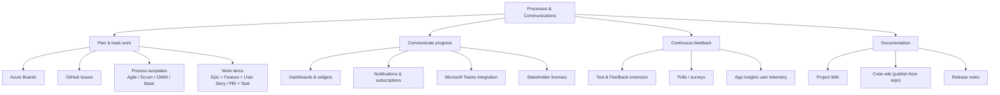
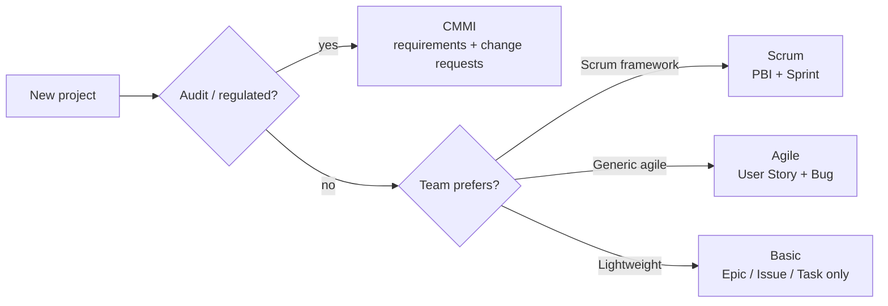
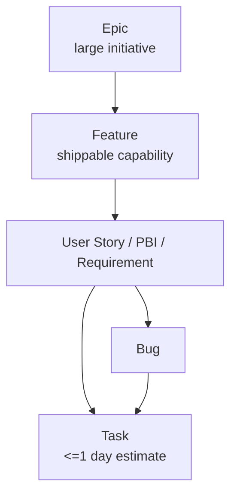
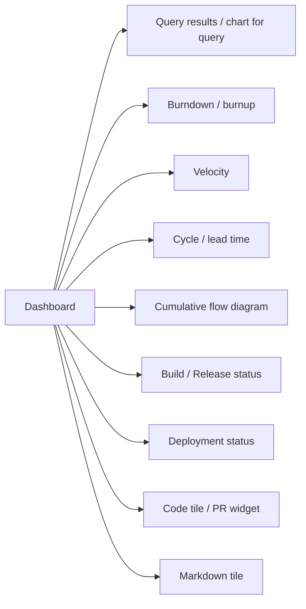
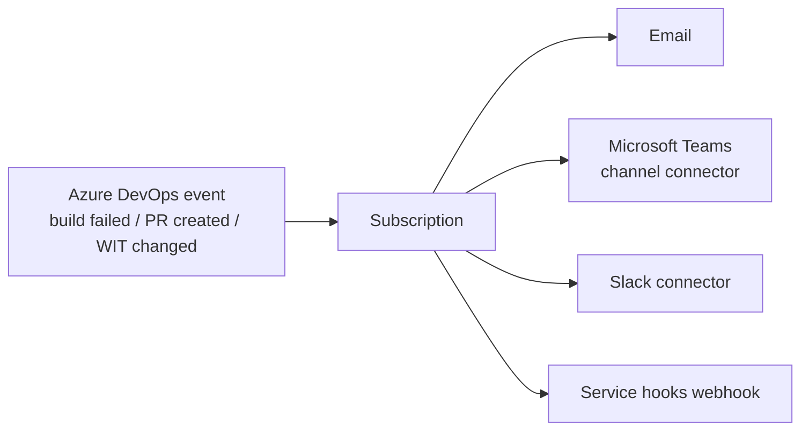
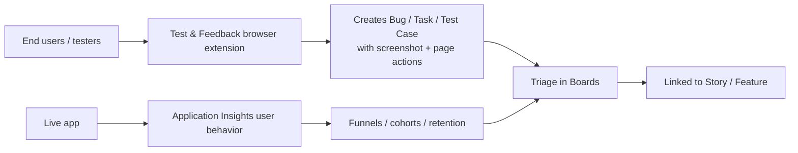

# Domain 1 - Processes & Communications

> **Weight: 10-15%.** Plan work, gather feedback, and communicate. Lightest domain by volume but full of "which tool / which artifact" recall questions.

---

## Domain mind map

## Concept map

---

## Process templates - pick once, can't change later (in Azure DevOps)

| Template | Top-level work item | Use when |
|---|---|---|
| **Basic** | Epic -> Issue -> Task | New / small teams, simple flow |
| **Agile** | Epic -> Feature -> User Story -> Task | General agile, "User Story" terminology |
| **Scrum** | Epic -> Feature -> PBI -> Task | Strict Scrum framework |
| **CMMI** | Epic -> Feature -> Requirement -> Task | Auditable, formal change management |

> Inherited processes (custom fields / states) only apply to projects on the **inherited** model, not the legacy Hosted XML.

---

## Work-item hierarchy

- **Backlog** = the prioritized list at one level (epic backlog, feature backlog, story backlog).
- **Sprint backlog** = stories pulled into a time-box.
- **Delivery Plans** = cross-team Gantt-style view of features by iteration.

---

## Dashboards & widgets

Common widget categories you should be able to name:

- Permissions: dashboards can be **team** or **project**; managed via the dashboard "Manage permissions" dialog.
- For real-time stakeholder views, prefer the public team dashboard + Stakeholder license (free) over Basic licenses.

---

## Notifications & Microsoft Teams

- **Service hooks** = generic webhook publisher (Teams, Slack, Trello, Jenkins, Azure Service Bus, custom HTTP).
- **Notifications** = per-user or team subscription on built-in events.
- For stakeholder-only updates (no DevOps license), use Teams channel posts driven by service hooks.

---

## Wiki

| Wiki type | Source of truth | Edit where |
|---|---|---|
| **Project wiki** | Provisioned by the project | Edit in Azure DevOps UI |
| **Code wiki** (publish from repo) | A folder in a Git repo | Edit via PR (full review flow) |

Use **code wiki** when you want documentation reviewed alongside code (CODEOWNERS, branch policies).

---

## Continuous feedback

- Test & Feedback extension has two modes: **standalone** (anonymous, exports XML) and **connected** (signed-in, files items in your project).
- For exam: "feedback from non-licensed users" -> Stakeholder license + Test & Feedback connected mode.

---

## Decision reference

| When you see... | Pick... | Why |
|---|---|---|
| Strict Scrum terms (PBI, Sprint) | **Scrum** template | Native PBI work item type |
| Customer requires audit trail of requirement changes | **CMMI** template | Formal change request work items |
| Lightweight team, no formal hierarchy | **Basic** template | Just Epic / Issue / Task |
| Stakeholder needs read-only board access | **Stakeholder** license (free) | Free + view & comment on items |
| Notify a Teams channel on PR completion | **Teams connector** + service hook / subscription | Native integration |
| Cross-team roadmap with dates | **Delivery Plans** | Multi-team Gantt by iteration |
| Documentation reviewed via PR | **Code wiki** (publish from repo) | Branch policies + CODEOWNERS apply |
| Capture browser feedback with screenshots | **Test & Feedback** extension | Built-in, ties to work items |

---

## Common pitfalls

- **Cannot change process template** of a project after creation. You must migrate to a new project or use the inherited process model up front.
- Stakeholder license **cannot run pipelines or edit code**, but can view dashboards, file bugs, and approve releases on Public projects.
- Wiki page **moves break links** unless you use the rename feature within the wiki UI.
- Tag-based dashboards stop working when tags are renamed - pin queries instead.

---

## Microsoft Learn

- [Plan agile with Azure Boards](https://learn.microsoft.com/training/modules/choose-an-agile-approach/)
- [Customize Azure Boards](https://learn.microsoft.com/azure/devops/boards/work-items/guidance/choose-process)
- [Dashboards in Azure DevOps](https://learn.microsoft.com/azure/devops/report/dashboards/)
- [Service hooks events](https://learn.microsoft.com/azure/devops/service-hooks/events)
- [Test & Feedback extension](https://learn.microsoft.com/azure/devops/test/perform-exploratory-tests)

---

[<- Master Index](00-MASTER-INDEX.md) - [Source Control ->](02-source-control.md)
