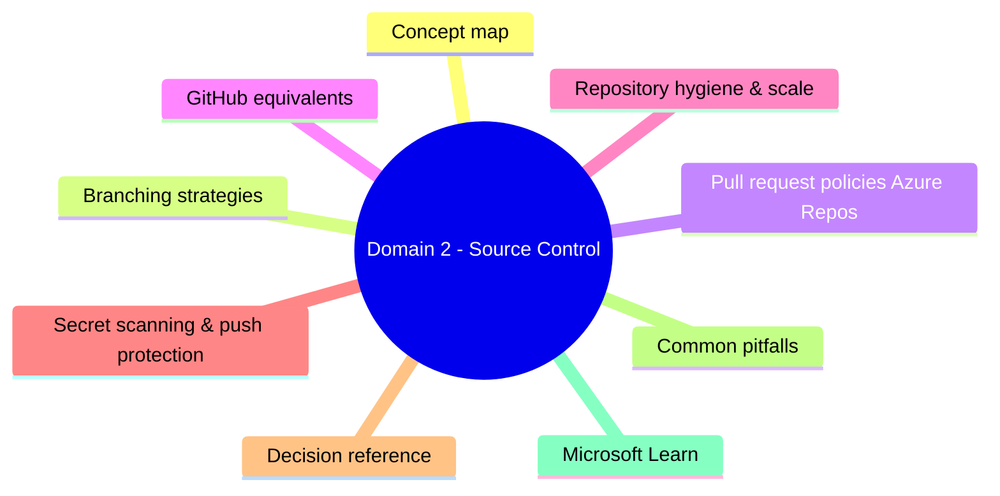
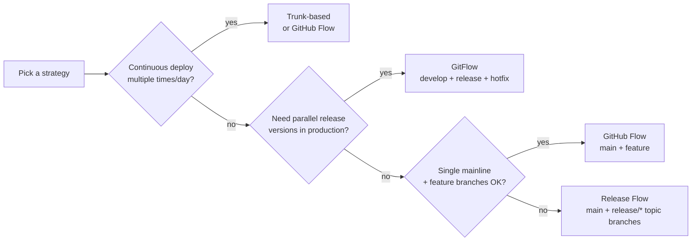
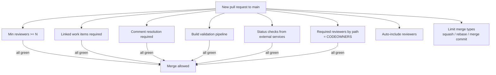
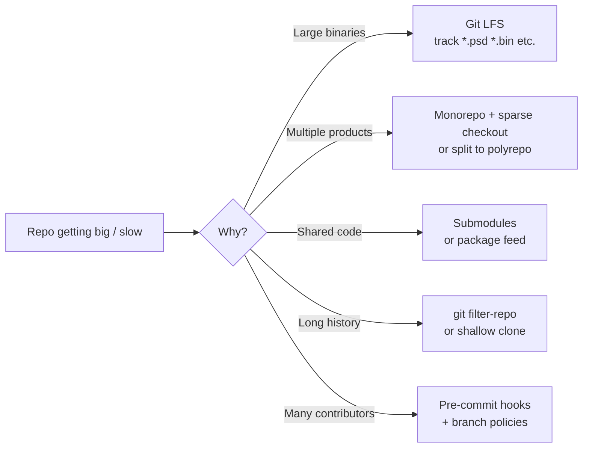
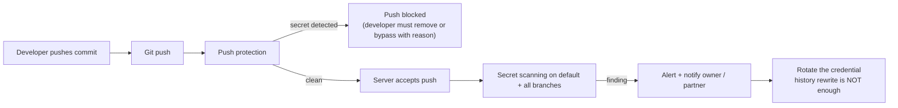

# Domain 2 - Source Control

> **Weight: 15-20%.** Git, branching strategies, pull-request policies, and repository hygiene. Heavy on "which branching model" and "which policy" questions.

---

## Domain mind map

## Concept map

```mermaid
flowchart TD
    Root["Source Control"]
    Root --> Hosts["Hosting"]
    Root --> Branch["Branching strategy"]
    Root --> PR["Pull requests & policies"]
    Root --> Hygiene["Repo hygiene & scale"]

    Hosts --> ADO[Azure Repos Git]
    Hosts --> GH[GitHub Repos]
    Hosts --> TFVC["TFVC<br/>legacy centralized"]

    Branch --> Trunk[Trunk-based development]
    Branch --> GHFlow["GitHub Flow<br/>main + short-lived"]
    Branch --> GitFlow["GitFlow<br/>develop + release + hotfix"]
    Branch --> Release["Release Flow<br/>Microsoft style"]

    PR --> Pol[Branch policies]
    PR --> Reviewers[Required reviewers]
    PR --> Build[Build validation]
    PR --> Path[Path filters & CODEOWNERS]
    PR --> Linked[Linked work items]
    PR --> Status[Status checks]

    Hygiene --> LFS[Git LFS]
    Hygiene --> Sub[Submodules]
    Hygiene --> Mono[Monorepo vs polyrepo]
    Hygiene --> Sparse["Sparse checkout / partial clone"]
    Hygiene --> Hooks["Git hooks / pre-commit"]
    Hygiene --> Secret["Secret scanning + push protection"]
```

---

## Branching strategies

| Strategy | Long-lived branches | Best for |
|---|---|---|
| **Trunk-based** | `main` only | High-frequency CI/CD, feature flags |
| **GitHub Flow** | `main` only, short-lived feature branches | SaaS / web / continuous deployment |
| **Release Flow** | `main` + `release/*` topic | Microsoft-style, ship trains |
| **GitFlow** | `main`, `develop`, `release/*`, `hotfix/*` | Versioned products, multi-version support |

> Modern default: **trunk-based with short-lived feature branches and feature flags**. GitFlow is increasingly considered legacy.

---

## Pull request policies (Azure Repos)

- "Required" policies block merge; "Optional" policies just inform.
- **Build validation** triggers a CI pipeline against the PR's merged commit; it can be set to expire after N hours of inactivity.
- **Path filters** scope a policy or required-reviewer rule to specific folders (e.g. `/infra/*` requires the platform team).

---

## GitHub equivalents

| Azure Repos | GitHub |
|---|---|
| Branch policy | **Branch protection rule** / **rulesets** |
| Required reviewers (path) | **CODEOWNERS** + required reviews |
| Build validation | **Required status checks** (Actions / external) |
| Linked work items required | Linked issues (informational only) |
| Auto-complete | Auto-merge |
| Squash / rebase / merge | Allowed merge methods (repo settings) |

---

## Repository hygiene & scale

- **`.gitignore`** = paths Git ignores; **`.gitattributes`** = per-path normalization (line endings, LFS, diff/merge driver).
- **CODEOWNERS** lives at repo root or `.github/` (GitHub) / `.azuredevops/` (Azure Repos) and assigns mandatory reviewers by path glob.
- **Submodules** pin a commit of another repo; **subtrees** copy history in. Both fragile vs. simply consuming a versioned package from a feed.

---

## Secret scanning & push protection

- GitHub: **GitHub Advanced Security** (now part of **GitHub Secret Protection** + **GitHub Code Security**) provides secret scanning + push protection.
- Azure DevOps: **Advanced Security for Azure DevOps** (paid per active committer) brings the same features into Azure Repos.
- Azure Defender for DevOps surfaces secret-scanning alerts from connected GitHub / Azure DevOps orgs in **Microsoft Defender for Cloud**.

---

## Decision reference

| When you see... | Pick... | Why |
|---|---|---|
| "Multiple times-per-day deploys" | **Trunk-based** + feature flags | Avoids long merges |
| "Maintain v1 and v2 in parallel" | **GitFlow** with `release/*` branches | Hotfixes flow back to main |
| "Microsoft Engineering style" | **Release Flow** | One mainline + topic branches |
| "Block merge until reviewer approves" | **Required reviewers** policy | Hard gate |
| "Run unit tests on every PR" | **Build validation** policy | CI pipeline check |
| "Different teams own different folders" | **CODEOWNERS** + path policy | Auto-required reviewers |
| "Repo huge with binary assets" | **Git LFS** | Large file pointers |
| "Block credentials from being pushed" | **Push protection** (GHAS / Advanced Security) | Pre-receive block |
| "Detect leaked secrets in history" | **Secret scanning** | Server-side scan |

---

## Common pitfalls

- Using `git rebase` on a **shared branch** rewrites history others depend on - only rebase your own feature branch before PR.
- Merging a PR via the API or local push **bypasses branch policies** unless the policy is enforced at the server level (Azure Repos enforces; GitHub requires "include administrators" + rulesets).
- **`history rewrite` does not invalidate a leaked secret.** Rotate the credential.
- Submodules require `git clone --recurse-submodules` and `git submodule update --init` - easy to forget in CI.
- LFS files **count against LFS storage / bandwidth quotas separately** from the regular repo.

---

## Microsoft Learn

- [Choose a Git branch strategy](https://learn.microsoft.com/azure/devops/repos/git/git-branching-guidance)
- [Set branch policies (Azure Repos)](https://learn.microsoft.com/azure/devops/repos/git/branch-policies)
- [About protected branches (GitHub)](https://docs.github.com/repositories/configuring-branches-and-merges-in-your-repository/managing-protected-branches/about-protected-branches)
- [About CODEOWNERS](https://docs.github.com/repositories/managing-your-repositorys-settings-and-features/customizing-your-repository/about-code-owners)
- [Secret scanning](https://docs.github.com/code-security/secret-scanning/about-secret-scanning)
- [Advanced Security for Azure DevOps](https://learn.microsoft.com/azure/devops/repos/security/configure-github-advanced-security-features)

---

[<- Processes & Communications](01-processes-and-communications.md) - [Build & Release Pipelines ->](03-build-and-release-pipelines.md)
