# Domain 3 - Build & Release Pipelines

> **Weight: 40-45%.** The biggest domain by far. Master YAML pipelines, GitHub Actions, deployment strategies, package management, and Infrastructure as Code.

---

## Domain mind map

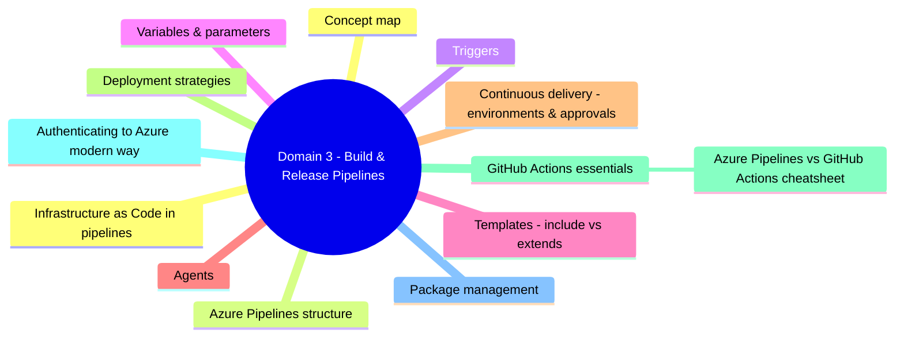

## Concept map

```mermaid
flowchart TD
    Root["Build & Release Pipelines"]
    Root --> Tools["Pipeline tools"]
    Root --> Struct["Structure & reuse"]
    Root --> Agents["Agents"]
    Root --> CD["Continuous delivery"]
    Root --> Pkg["Package management"]
    Root --> IaC["Infrastructure as Code"]

    Tools --> AzPipe["Azure Pipelines<br/>YAML"]
    Tools --> GHAct[GitHub Actions]
    Tools --> Classic["Classic Release pipelines<br/>legacy UI"]

    Struct --> Stages[Stages -> Jobs -> Steps]
    Struct --> Templates["Templates: include / extends"]
    Struct --> Params[Parameters & variables]
    Struct --> VG[Variable groups & Library]
    Struct --> KV[Key Vault-linked variable groups]
    Struct --> Reuse["Reusable workflows<br/>Composite actions"]

    Agents --> MSHosted[Microsoft-hosted agents]
    Agents --> SelfHosted[Self-hosted agents]
    Agents --> ScaleSet[Azure VMSS agent pools]
    Agents --> Runner["GitHub-hosted runners<br/>+ self-hosted runners + ARC"]

    CD --> Env[Environments]
    CD --> Approve[Approvals & gates]
    CD --> BG["Blue / Green"]
    CD --> Canary[Canary]
    CD --> Rolling[Rolling]
    CD --> Slot[App Service deployment slots]
    CD --> Flag[Feature flags]

    Pkg --> Artifacts[Azure Artifacts]
    Pkg --> GHPkg[GitHub Packages]
    Pkg --> Upstream[Upstream sources]
    Pkg --> Views["Feed views @prerelease @release"]

    IaC --> Bicep["Bicep / ARM"]
    IaC --> TF[Terraform]
    IaC --> Pulumi[Pulumi]
    IaC --> ADE[Azure Deployment Environments]
```

---

## Azure Pipelines structure

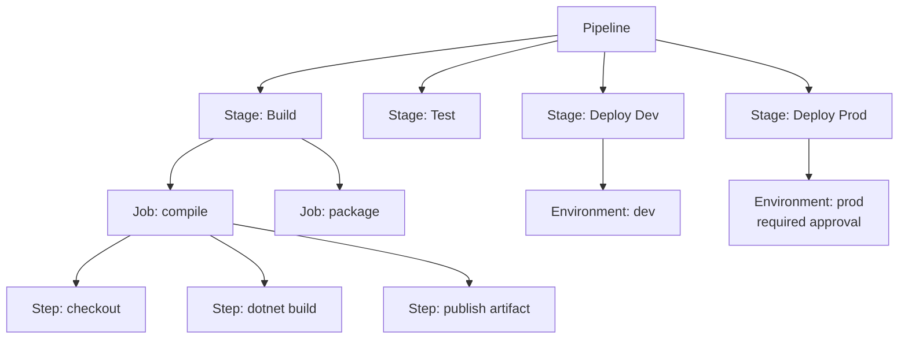

| Construct | Purpose | Notes |
|---|---|---|
| **Stage** | Major boundary, can require approvals | Parallel by default unless `dependsOn` set |
| **Job** | Runs on **one agent**, shares workspace | Can run in parallel within a stage |
| **Step** | A task or script | Sequential within a job |
| **Task** | Pre-built marketplace step | Versioned, e.g. `AzureWebApp@1` |
| **Template** | YAML reused via `template:` (include) or `extends:` (governance) | `extends` enforces required steps |

> Memorize: **Stage = approval gate, Job = agent boundary, Step = task.**

---

## Triggers

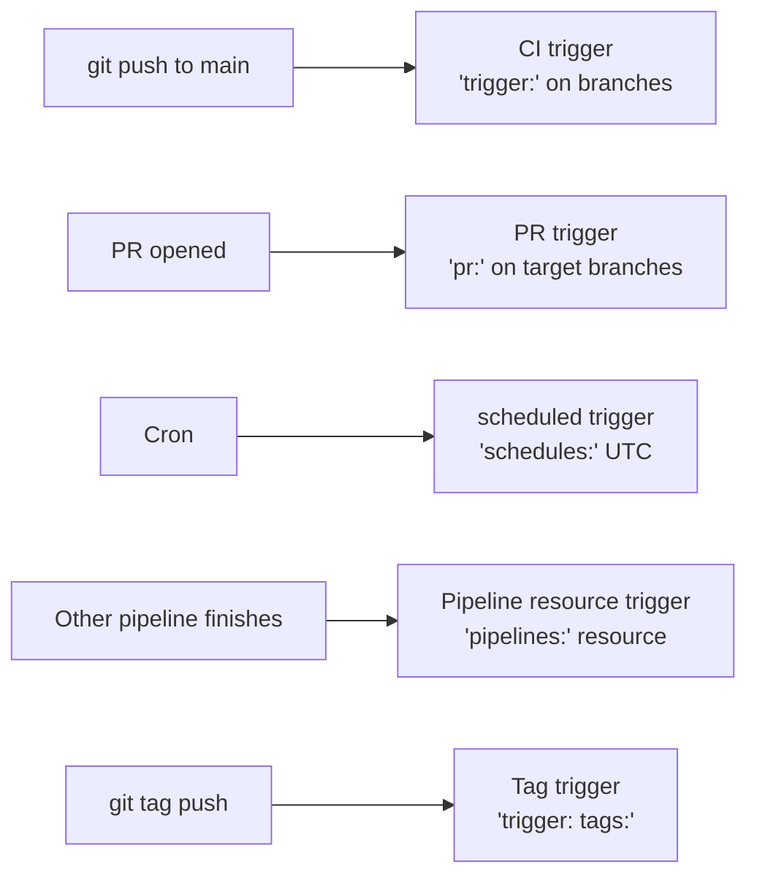

- `pr: none` disables PR triggers (only CI fires).
- For YAML pipelines, **branch policies** still need to wire the pipeline as **build validation** for PRs to block merge.

---

## Variables & parameters

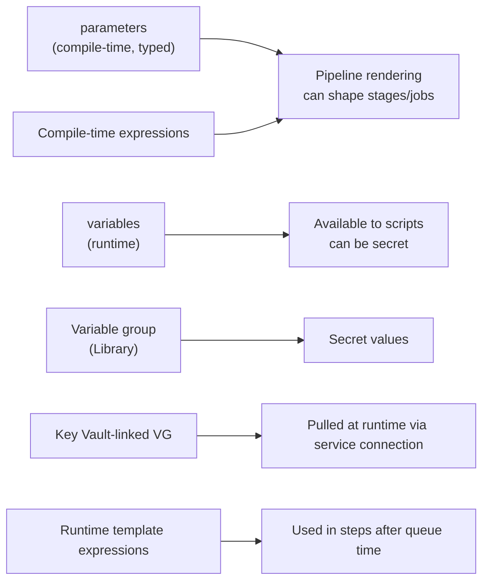

- **Compile-time `${{ }}`** = parameters and template expressions; resolved before run.
- **Runtime `$( )`** = variable substitution at task time.
- **Runtime expressions `$[ ]`** = `dependencies.JobA.outputs['...']` and similar.
- Secret variables are **never** exposed to scripts unless explicitly mapped via `env:` or `--arg`.

---

## Templates: include vs extends

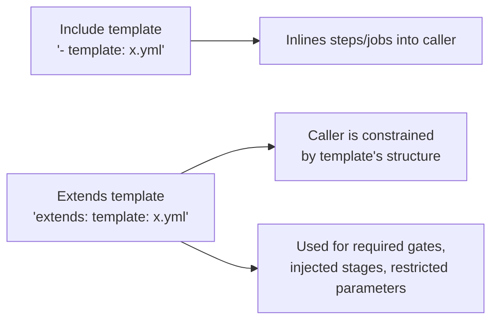

- Use **`extends`** for **governance** (security team owns the template; project YAML can only fill in allowed parameters).
- Use **`includes`** (`- template:`) for **convenience reuse** of common steps.

---

## Agents

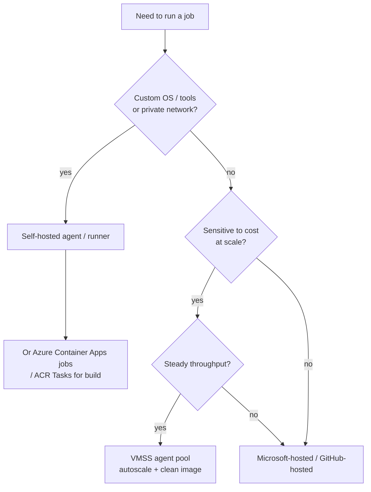

- **Microsoft-hosted agent**: ephemeral VM, latest images, free minutes per org, slowest cold starts.
- **Self-hosted agent**: your VM, your tools, your network. You patch it.
- **Azure VMSS agent pool**: auto-scale self-hosted agents from a custom image; idle scale-down.
- **GitHub Actions Runner Controller (ARC)**: self-hosted runners on Kubernetes with autoscale.
- **Larger / GPU runners** are available as paid SKUs on both platforms.

---

## Continuous delivery: environments & approvals

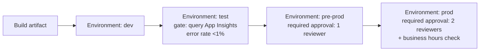

Approval / gate types:

| Check | Type | Use |
|---|---|---|
| **Approvals** | Manual | Human signs off |
| **Branch control** | Auto | Only deploy from `main` or `release/*` |
| **Business hours** | Auto | Block off-hours deploys |
| **Invoke REST API** | Auto | External system veto |
| **Query Azure Monitor** | Auto | Health gate from metrics |
| **Required template** | Auto | Caller must extend an approved template |

---

## Deployment strategies

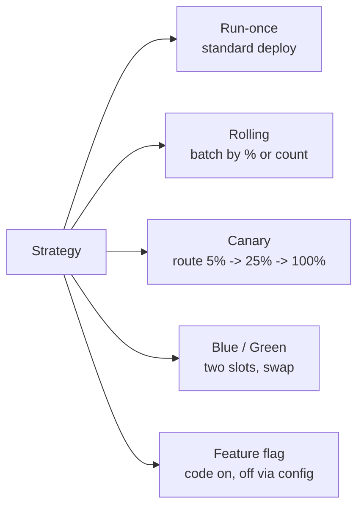

| Strategy | Rollback | Best for |
|---|---|---|
| **Run-once** | Redeploy old | Simple apps |
| **Rolling** | Pause + redeploy | Large fleets (VMSS) |
| **Canary** | Reduce % to 0 | High-risk web changes |
| **Blue/Green** | Swap back instantly | App Service slots, AKS services |
| **Feature flags** | Toggle off | Decouple deploy from release |

> **App Service deployment slots** = built-in blue/green. Warm-up before swap; swap with preview to test settings.

---

## GitHub Actions essentials

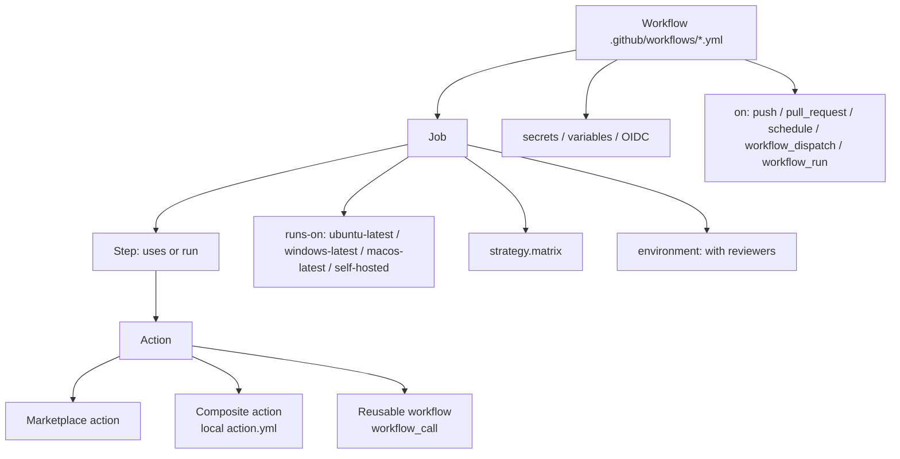

- **Composite action** = reusable steps in a single action.
- **Reusable workflow** = entire job/workflow callable from another via `uses: org/repo/.github/workflows/x.yml@ref`.
- **`workflow_dispatch`** = manual run (with inputs).
- **`environment:` on a job** lets you require reviewers + variable scoping (parallels Azure Pipelines environments).

### Azure Pipelines vs GitHub Actions cheatsheet

| Concept | Azure Pipelines | GitHub Actions |
|---|---|---|
| Pipeline file | `azure-pipelines.yml` | `.github/workflows/*.yml` |
| Reuse | Templates (`template:` / `extends:`) | Reusable workflows + composite actions |
| Approvals | Environments | Environments |
| Secret store | Library / Variable Groups + Key Vault | Repo / org / environment secrets + Key Vault via OIDC |
| Marketplace | Tasks | Actions |
| Authenticate to Azure | Service connection (workload identity preferred) | OIDC + `azure/login@v2` |

---

## Authenticating to Azure (modern way)

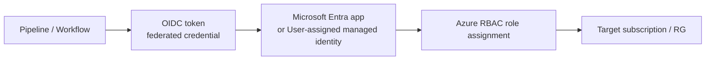

- **Workload identity federation** = pipeline mints a short-lived OIDC token; no client secret stored.
- Azure Pipelines: create a **service connection (workload identity federation)**.
- GitHub Actions: configure a **federated credential** on an Entra app + use `azure/login@v2` with `client-id`, `tenant-id`, `subscription-id`.

> Old way: **service principal with client secret**. Avoid storing long-lived secrets when OIDC is available.

---

## Package management

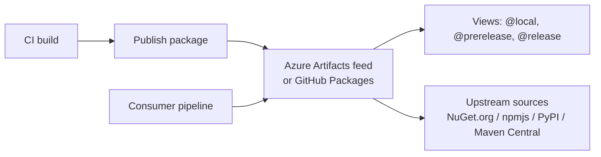

- **Feed views** promote a package version through quality gates: `@local` -> `@prerelease` -> `@release`.
- **Upstream sources** mean the feed proxies + caches public-registry packages, removing direct internet dependency for builds.
- Azure Artifacts feeds support: NuGet, npm, Maven, Python, Cargo, Universal packages.

---

## Infrastructure as Code in pipelines

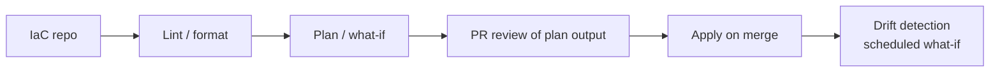

| Tool | Strength | Pipeline notes |
|---|---|---|
| **Bicep** | First-party Azure DSL, transpiles to ARM | `az deployment group create --what-if` for plan |
| **ARM templates** | Native JSON | Same `what-if` |
| **Terraform** | Multi-cloud, state-based | `terraform plan` / `apply`; remote state in Azure Storage with lease lock |
| **Azure Deployment Environments (ADE)** | Self-service env catalog (templates + RBAC) | Devs provision via portal/CLI from approved templates |
| **Pulumi** | Real code (TS / Python / Go / .NET) | Same plan/apply flow |

---

## Decision reference

| When you see... | Pick... | Why |
|---|---|---|
| "Reusable steps across multiple pipelines" | Pipeline **template** (`- template:`) | Include reuse |
| "Force every pipeline to run security scan" | **`extends:` template** in policy | Governance enforcement |
| "Hot caches, custom tools, private network" | **Self-hosted** or **VMSS agent pool** | Persistent state, network access |
| "No long-lived secrets to Azure" | **Workload identity federation** (OIDC) | Short-lived tokens |
| "Instant rollback web deploy" | **App Service deployment slots** swap | Blue/green built-in |
| "Roll out to 5% then 100%" | **Canary** strategy | Gradual exposure |
| "Toggle a feature without redeploy" | **Feature flag** (Azure App Configuration) | Runtime switch |
| "Promote package from build to QA to prod" | **Azure Artifacts feed views** | `@prerelease` / `@release` |
| "Block npm.org direct fetches" | **Upstream sources** on feed | Cached + filtered |
| "Preview infra changes before apply" | `az deployment what-if` / `terraform plan` | Diff in PR |
| "Self-service spin-up of dev env" | **Azure Deployment Environments** | Catalogued templates |

---

## Common pitfalls

- **Job vs stage parallelism**: jobs in a stage run in parallel by default; if order matters, use `dependsOn`.
- **Approvals on the environment, not the pipeline.** A YAML pipeline cannot itself require an approval; it must reference an environment that has one.
- **Secret variables aren't auto-mapped to env vars.** Use `env: MYVAR: $(MyVar)` in scripts.
- **Microsoft-hosted agents lose the workspace** between jobs. Pass artifacts explicitly via `publish`/`download`.
- **`displayName`** changes don't break pipeline references; **task names / variable names** do.
- **Concurrency**: a job consumes a parallel job slot per agent; pricing depends on Microsoft-hosted vs self-hosted parallel jobs.
- **Service principal secrets expire silently.** Prefer workload identity federation.
- **Branch protection bypass**: admins can override unless rulesets enforce on everyone.

---

## Microsoft Learn

- [Azure Pipelines YAML schema](https://learn.microsoft.com/azure/devops/pipelines/yaml-schema/)
- [Templates in Azure Pipelines](https://learn.microsoft.com/azure/devops/pipelines/process/templates)
- [Environments & approvals](https://learn.microsoft.com/azure/devops/pipelines/process/environments)
- [Deployment strategies](https://learn.microsoft.com/azure/devops/pipelines/process/deployment-jobs)
- [Workload identity federation for service connections](https://learn.microsoft.com/azure/devops/pipelines/release/configure-workload-identity)
- [GitHub Actions documentation](https://docs.github.com/actions)
- [OIDC: Configure Azure for GitHub Actions](https://learn.microsoft.com/azure/developer/github/connect-from-azure-openid-connect)
- [Azure Artifacts: feeds, views, upstreams](https://learn.microsoft.com/azure/devops/artifacts/concepts/feeds)
- [Azure Deployment Environments](https://learn.microsoft.com/azure/deployment-environments/)
- [App Service deployment slots](https://learn.microsoft.com/azure/app-service/deploy-staging-slots)

---

[<- Source Control](02-source-control.md) - [Security & Compliance ->](04-security-and-compliance.md)
