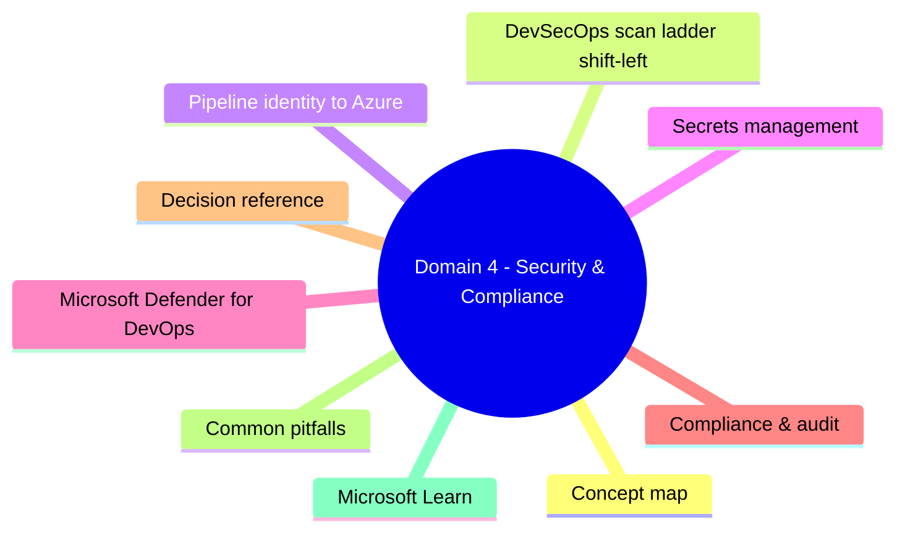
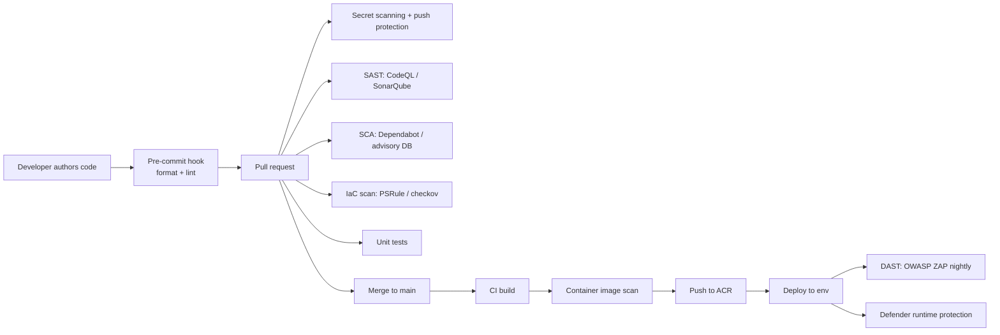
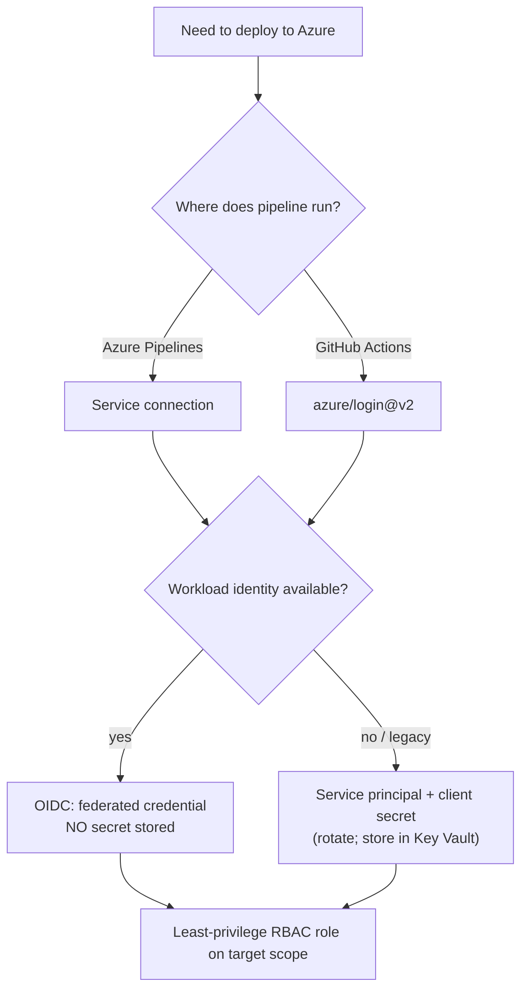
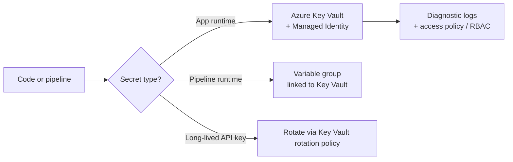
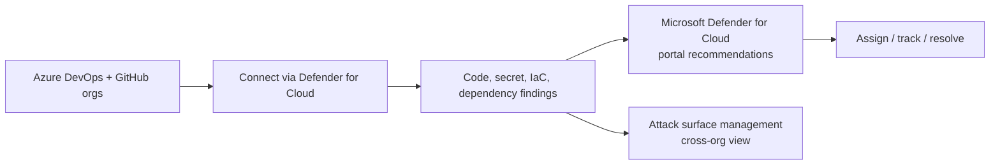
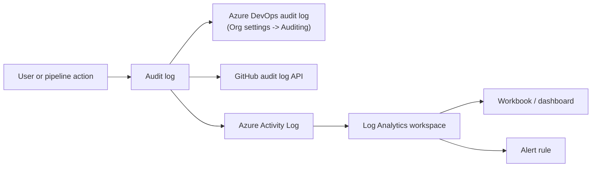

# Domain 4 - Security & Compliance

> **Weight: 10-15%.** DevSecOps practices, identity for pipelines, secrets management, scanning, and audit/compliance.

---

## Domain mind map

## Concept map

```mermaid
flowchart TD
    Root["Security & Compliance"]
    Root --> Shift["Shift-left scanning"]
    Root --> Id["Pipeline identity & secrets"]
    Root --> Defend["Microsoft Defender for DevOps"]
    Root --> Comp["Compliance & audit"]

    Shift --> SAST["SAST<br/>CodeQL / SonarQube"]
    Shift --> DAST["DAST<br/>OWASP ZAP"]
    Shift --> SCA["SCA / dependency<br/>Dependabot / GHAS"]
    Shift --> Sec["Secret scanning + push protection"]
    Shift --> Img["Container image scanning<br/>Defender / Trivy"]
    Shift --> IaCS["IaC scanning<br/>checkov / PSRule for Azure"]

    Id --> WIF[Workload Identity Federation OIDC]
    Id --> MI[Managed Identity]
    Id --> SP["Service principal<br/>(legacy with secret)"]
    Id --> KV[Azure Key Vault]
    Id --> Cred["Variable groups + secret variables"]

    Defend --> GHAS[GitHub Advanced Security]
    Defend --> ADOAS[Advanced Security for Azure DevOps]
    Defend --> MDC[Microsoft Defender for Cloud]

    Comp --> Audit["Audit logs<br/>Azure DevOps + GitHub"]
    Comp --> Pol[Azure Policy in pipelines]
    Comp --> Pur[Microsoft Purview]
    Comp --> Apv[Approvals as evidence]
```

---

## DevSecOps scan ladder (shift-left)

| Layer | Tool examples | Catches |
|---|---|---|
| **Lint / format** | ESLint, Black, dotnet-format | Style, simple bugs |
| **SAST** | CodeQL, SonarQube, Semgrep | Source-level vulns |
| **SCA** | Dependabot, OWASP DC, GHAS | Vulnerable dependencies |
| **Secret scan** | GHAS, Advanced Security | Leaked credentials |
| **IaC scan** | checkov, PSRule for Azure, terrascan | Mis-configured infra templates |
| **Container scan** | Defender for Containers, Trivy | OS / package CVEs in images |
| **DAST** | OWASP ZAP, Burp | Running-app vulns |
| **Runtime** | Defender for Cloud | Live workload threats |

---

## Pipeline identity to Azure

> Default to **OIDC / workload identity federation** for both Azure Pipelines and GitHub Actions. Only fall back to client-secret SPs when an upstream system can't do OIDC.

---

## Secrets management

- **Variable group linked to Key Vault** = pipeline pulls only the names you whitelist; values stay in KV.
- Prefer **secret references** in app config (App Service / Container Apps / Functions) rather than env vars.
- **Customer-managed keys (CMK)** for Key Vault: use **Managed HSM** or vault with CMK references for encryption-at-rest of the secret store itself.

---

## Microsoft Defender for DevOps

- **GitHub Advanced Security (GHAS)** features: code scanning (CodeQL), secret scanning + push protection, dependency review.
- **Advanced Security for Azure DevOps** (paid per active committer) brings the same to Azure Repos.
- **Defender for DevOps** gives a security team a **single pane of glass** across multiple repo orgs (GH + ADO) inside Defender for Cloud.

---

## Compliance & audit

- **Approvals on environments** double as compliance evidence - who approved what, when.
- **Azure Policy** can audit / deny non-compliant resources; deploy-if-not-exists can remediate (e.g., enable diagnostic settings, force HTTPS).
- **Microsoft Purview** catalogs data assets and surfaces sensitive-data scans - relevant when pipelines move data.
- Azure DevOps audit log retention and export to Log Analytics requires the audit-streaming feature on Enterprise plans.

---

## Decision reference

| When you see... | Pick... | Why |
|---|---|---|
| "No long-lived secrets in pipeline" | **Workload identity federation (OIDC)** | Short-lived tokens |
| "Block leaked credentials before push" | **Push protection** (GHAS / Advanced Security) | Pre-receive enforcement |
| "Find vulnerable npm/NuGet packages" | **Dependabot** / GHAS dependency review | SCA |
| "Find SQL injection in code review" | **CodeQL** code scanning | SAST |
| "Detect mis-configured Bicep" | **PSRule for Azure** in pipeline | IaC scan |
| "Test running app for OWASP Top 10" | **OWASP ZAP** in pipeline (DAST) | Black-box scan |
| "Pipeline needs prod RBAC for 1 hour" | **PIM**-eligible role + just-in-time | Least privilege |
| "App reads secret at runtime" | **Managed Identity -> Key Vault** | No secret in app |
| "Single view of all repo security findings" | **Defender for DevOps** | Cross-org dashboard |
| "Prove who approved prod deploy" | **Environment approval history** + audit log | Compliance evidence |
| "Force HTTPS on every Storage Account" | **Azure Policy** (deny / deployIfNotExists) | Continuous enforcement |

---

## Common pitfalls

- **Storing PATs / SP secrets in pipeline variables** instead of Key Vault - rotates poorly, leaks in logs if `isOutput: true` and not marked secret.
- **Granting Owner / Contributor** to a service connection where Reader + Website Contributor would do.
- **Skipping secret scanning on private repos** - secrets leak via forks, gists, history rewrites.
- **Letting Dependabot PRs pile up** - turn on auto-merge for patch-level updates after CI passes.
- **Approvals on the wrong environment** - make sure prod approvers != developers (separation of duties).
- **Not enabling diagnostic settings** on Key Vault / ACR / Defender resources - no audit trail when needed.
- **Long-lived service principal secrets** - set rotation policy or migrate to OIDC.

---

## Microsoft Learn

- [DevSecOps in Azure](https://learn.microsoft.com/azure/architecture/solution-ideas/articles/devsecops-in-azure)
- [Workload identity federation](https://learn.microsoft.com/entra/workload-id/workload-identity-federation)
- [GitHub Advanced Security](https://docs.github.com/get-started/learning-about-github/about-github-advanced-security)
- [Microsoft Defender for DevOps](https://learn.microsoft.com/azure/defender-for-cloud/defender-for-devops-introduction)
- [Azure Key Vault overview](https://learn.microsoft.com/azure/key-vault/general/overview)
- [Managed identities](https://learn.microsoft.com/entra/identity/managed-identities-azure-resources/overview)
- [Azure Policy overview](https://learn.microsoft.com/azure/governance/policy/overview)
- [Audit log streaming (Azure DevOps)](https://learn.microsoft.com/azure/devops/organizations/audit/auditing-streaming)

---

[<- Build & Release Pipelines](03-build-and-release-pipelines.md) - [Instrumentation ->](05-instrumentation.md)
