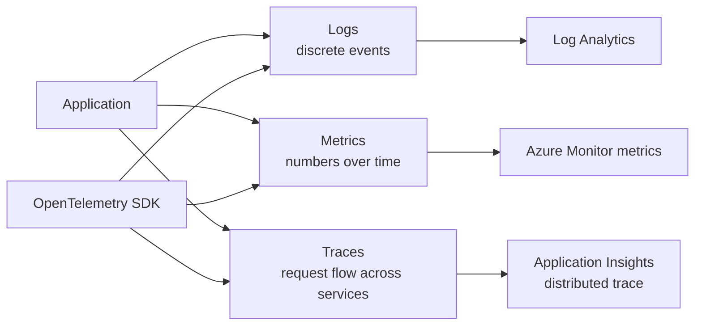
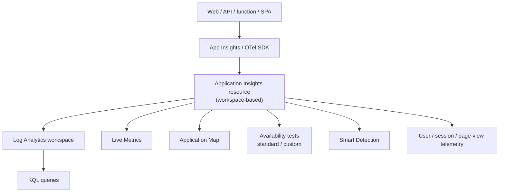
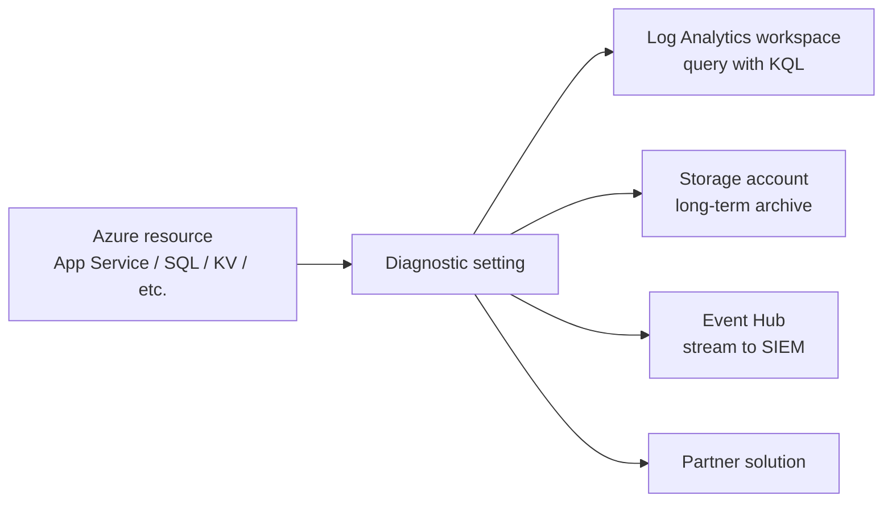
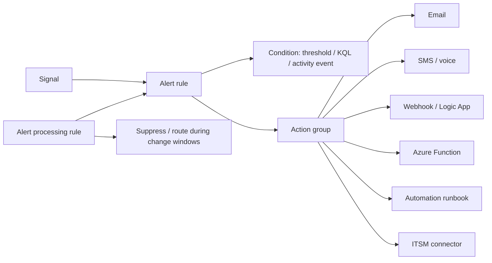
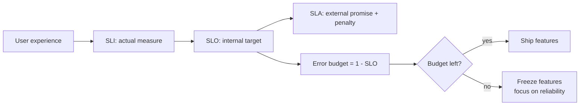

# Domain 5 - Instrumentation

> **Weight: 15-20%.** Logs, metrics, traces, alerting, and SRE practices. Application Insights + Azure Monitor + KQL are everywhere on this domain.

---

## Concept map

```mermaid
flowchart TD
    Root["Instrumentation"]
    Root --> Pillars["Observability pillars"]
    Root --> AppI["Application Insights"]
    Root --> Mon["Azure Monitor & Log Analytics"]
    Root --> Alert["Alerts & response"]
    Root --> SRE["SRE practices"]

    Pillars --> Logs[Logs]
    Pillars --> Metrics[Metrics]
    Pillars --> Traces["Traces / spans"]
    Pillars --> OTel[OpenTelemetry]

    AppI --> Live[Live Metrics]
    AppI --> Map[Application Map]
    AppI --> Avail[Availability tests]
    AppI --> Smart[Smart Detection]
    AppI --> Funnel["Funnels / cohorts / impact / users"]
    AppI --> Workspace[Workspace-based App Insights]

    Mon --> LAW[Log Analytics workspace]
    Mon --> KQL[KQL queries]
    Mon --> Diag[Diagnostic settings]
    Mon --> Wb[Workbooks]
    Mon --> Dash[Azure dashboards]

    Alert --> Rule["Alert rules<br/>metric / log / activity-log"]
    Alert --> AG[Action groups]
    Alert --> AP[Alert processing rules]
    Alert --> Smart2[Smart Detection]

    SRE --> SLI[SLIs]
    SRE --> SLO[SLOs]
    SRE --> SLA[SLAs]
    SRE --> Budget[Error budgets]
    SRE --> IR["Incident response<br/>postmortems"]
```



---

## Three pillars of observability



- **Metrics** = cheap, fast, low-cardinality (CPU %, request count). Stored time-series.
- **Logs** = high-cardinality structured events. Stored in Log Analytics, queried with KQL.
- **Traces** = parent/child spans across services to debug latency.
- **OpenTelemetry** is the recommended SDK; Azure Monitor exporter ships data into App Insights / Log Analytics.

---

## Application Insights



| Feature | Use |
|---|---|
| **Live Metrics** | Real-time dashboard during deploys |
| **Application Map** | Auto-discovered topology + failure rates |
| **Availability tests** | Synthetic ping / multi-step from regions |
| **Smart Detection** | ML-based anomaly alerts (response time, failure rate) |
| **Funnels / cohorts / retention** | Product analytics on user behavior |
| **Release annotations** | Mark deploy events on charts |

> **Workspace-based Application Insights** is the current default. Classic standalone AI is deprecated; migrate to workspace-based.

---

## KQL essentials

```kql
// last hour of request failures grouped by operation
requests
| where timestamp > ago(1h)
| where success == false
| summarize failures = count() by operation_Name
| order by failures desc

// p95 server response time, 5-minute bins
requests
| where timestamp > ago(24h)
| summarize p95 = percentile(duration, 95) by bin(timestamp, 5m)
| render timechart

// correlate exceptions with the request that produced them
exceptions
| join kind=inner (requests) on operation_Id
| project timestamp, operation_Name, type, outerMessage, resultCode
```

Operators to memorize: `where`, `project`, `extend`, `summarize`, `bin()`, `percentile()`, `count()`, `join`, `union`, `render`, `parse`, `let`, `top`, `take`.

---

## Diagnostic settings -> where logs go



- A resource can have **up to 5 diagnostic settings**, each routing to one or more destinations.
- Activity Log can be exported the same way.
- For multi-subscription central logging, point all settings at one **central Log Analytics workspace** (Sentinel pattern).

---

## Alerts & action groups



| Alert type | Source | Use |
|---|---|---|
| **Metric alert** | Azure Monitor metrics | Threshold, dynamic threshold |
| **Log alert** | KQL on Log Analytics | Complex correlations |
| **Activity-log alert** | Subscription-level events | Resource created / role assigned |
| **Smart Detection** | App Insights ML | Anomalies you didn't think to alert on |
| **Service health alert** | Azure platform | Region outage / planned maint |

- **Action group** = reusable notification target.
- **Alert processing rule** = filter / suppress / route alerts during deployments or maintenance windows.

---

## SRE practices



| Term | Meaning |
|---|---|
| **SLI** | Service Level Indicator - actual measurement (e.g., % requests <300ms) |
| **SLO** | Service Level Objective - your internal target (e.g., 99.9%) |
| **SLA** | Service Level Agreement - contractual; usually weaker than SLO |
| **Error budget** | `1 - SLO` allowed unreliability per period |
| **MTTR** | Mean Time To Recover |
| **MTBF** | Mean Time Between Failures |

---

## Decision reference

| When you see... | Pick... | Why |
|---|---|---|
| "Real-time view during deploy" | **Live Metrics** | Sub-second telemetry |
| "Auto-detect anomalies without authoring rules" | **Smart Detection** | ML-driven |
| "Monitor multi-region uptime from outside" | **Availability tests** (standard / multi-step) | Synthetic |
| "Correlate logs across multiple Azure services" | **Diagnostic settings -> central Log Analytics workspace** | Unified KQL |
| "Suppress alerts during change window" | **Alert processing rule** | Targeted suppression |
| "Track release impact on users" | **Release annotation** + funnels / cohorts | Release-aware analytics |
| "Define a reliability target" | **SLO** with **error budget** | Drives prioritization |
| "Stream logs to third-party SIEM" | **Diagnostic settings -> Event Hub** | SIEM connector |
| "Open ticket from alert" | **Action group -> ITSM connector** / Logic App | Workflow automation |
| "Same alert triggers many emails" | **Alert processing rule** + suppression | De-noise |

---

## Common pitfalls

- Forgetting to **enable diagnostic settings** - Activity Log and resource logs are NOT collected by default.
- Querying classic Application Insights vs workspace-based: classic has separate tables; workspace-based puts data in `AppRequests`, `AppExceptions`, etc. in Log Analytics.
- **Sampling** on App Insights drops events to control cost - `itemCount` reveals the true count when summing.
- **Log alerts** have minimum frequency / latency limits (typically 1-5 minutes); don't expect millisecond response.
- **Action groups** have throttling; high-cardinality alerts can starve notifications.
- **Cost control**: ingest reduces cost via daily caps, basic logs (cheaper, query-limited), or commitment tiers.

---

## Microsoft Learn

- [Application Insights overview](https://learn.microsoft.com/azure/azure-monitor/app/app-insights-overview)
- [OpenTelemetry with Application Insights](https://learn.microsoft.com/azure/azure-monitor/app/opentelemetry-overview)
- [Workspace-based Application Insights](https://learn.microsoft.com/azure/azure-monitor/app/create-workspace-resource)
- [Diagnostic settings](https://learn.microsoft.com/azure/azure-monitor/essentials/diagnostic-settings)
- [Azure Monitor alerts](https://learn.microsoft.com/azure/azure-monitor/alerts/alerts-overview)
- [KQL quick reference](https://learn.microsoft.com/azure/data-explorer/kql-quick-reference)
- [SRE: Site Reliability Engineering](https://learn.microsoft.com/training/paths/sre-foundation/)

---

[<- Security & Compliance](04-security-and-compliance.md) - [Exam Cheatsheet ->](05-exam-cheatsheet.md)
