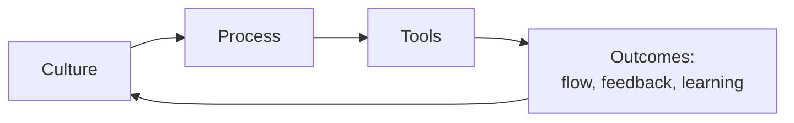
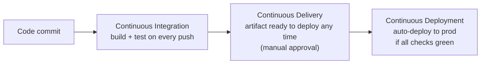
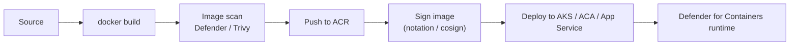
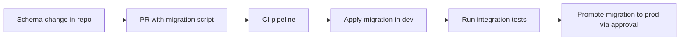
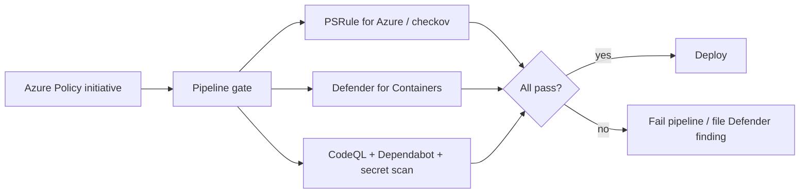

# Extra AZ-400 Concepts

> Concepts that don't fit cleanly under one domain but appear on the exam.

---

## DevOps philosophy (Microsoft model)

- DevOps = the **union of people, process, and products** to enable continuous delivery of value.
- Three ways (Phoenix Project): **Flow**, **Feedback**, **Continuous learning & experimentation**.
- DORA metrics: **Deployment frequency**, **Lead time for changes**, **Change failure rate**, **Mean time to recover**.

---

## CI vs CD vs Continuous Deployment

| Term | Manual approval to prod? |
|---|---|
| CI | n/a - only builds + tests |
| Continuous Delivery | **Yes** |
| Continuous Deployment | **No** - fully automated |

---

## Containers in CI/CD

- **ACR Tasks** can build + scan + push images on resource changes (e.g., base image updated).
- Use **content trust / image signing** (Notation, cosign) + **admission policy** (e.g., Ratify) for AKS to enforce only signed images.

---

## Database DevOps

- Tools: **DACPAC / SqlPackage**, **EF Core migrations**, **Flyway**, **Liquibase**.
- Patterns: expand-and-contract for zero-downtime; never break old code with new schema.

---

## Mobile DevOps

- **App Center** is being **retired (March 31, 2025 already passed)**; modern stack is GitHub Actions / Azure Pipelines + **Visual Studio App Center alternatives** (Firebase, Codemagic, App Store Connect API, Google Play Developer API).
- For test automation on real devices, look at **App Center Test alternatives**, **Firebase Test Lab**, **BrowserStack App Live**, **Sauce Labs**.

---

## Compliance scanning gates

---

## Cost-management tactics for pipelines

- **Microsoft-hosted parallel jobs** are the meter - buy more or move heavy work to **self-hosted / VMSS pools**.
- **Cache** (npm, NuGet, Maven) cuts build minutes dramatically.
- **Path filters** + monorepo conditional jobs avoid building untouched components.
- **Stop notifications spam** with action groups + alert processing rules.
- **Log Analytics**: use **Basic Logs** for high-volume / rarely queried streams; commitment tiers for steady ingest.

---

## What NOT to do

- Don't store secrets in pipeline YAML or repo files. Ever.
- Don't use Owner / Contributor where Reader + Web Contributor would do.
- Don't merge by force-push to bypass policies.
- Don't put long-lived production credentials in a service principal client secret if OIDC works.
- Don't ship without **release annotations** in App Insights - you'll never correlate regressions.
- Don't run ad-hoc `kubectl apply` in prod - capture it in IaC and replay.

---

[<- References](06-references.md) - [Master Index ->](00-MASTER-INDEX.md)
