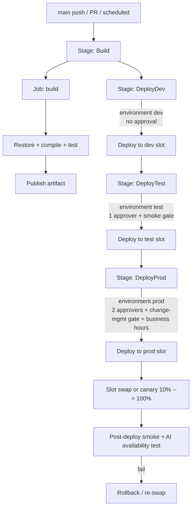
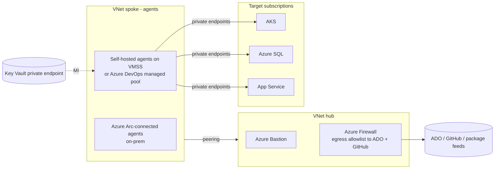
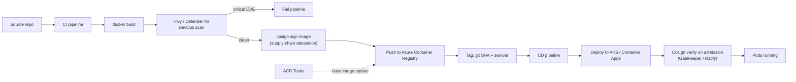
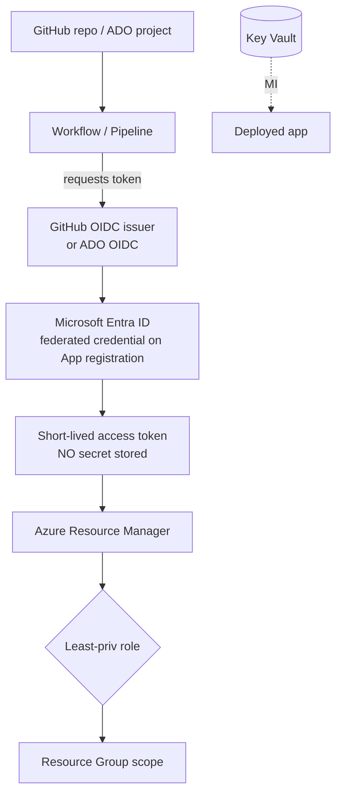
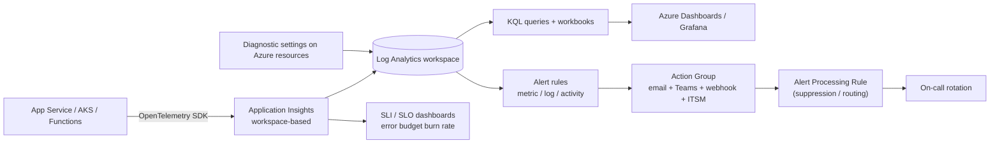
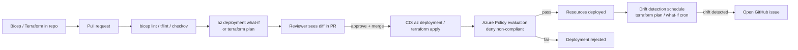
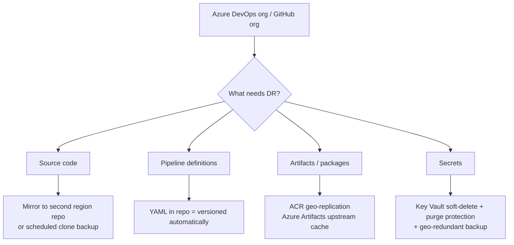

# Architectures - AZ-400

End-to-end DevOps reference architectures that pull multiple AZ-400 domains together. Each one ties **source -> build -> release -> security -> instrumentation** into a single picture.

---

## 1. End-to-end CI/CD on Azure (App Service / Container Apps)

```mermaid
flowchart LR
    Dev[Developer] -->|git push| GH[GitHub repo<br/>main + feature branches]
    GH -->|branch policy / required check| PR[Pull request]
    PR -->|merged to main| GHA["GitHub Actions<br/>(or Azure Pipelines)"]
    GHA --> Build[Build + unit test]
    Build --> Scan["Security scans<br/>SAST / SCA / secrets / container"]
    Scan --> Pkg[Push image to ACR<br/>or artifact to Azure Artifacts]
    Pkg --> ENV1[Env: dev<br/>auto deploy]
    ENV1 -->|approval gate| ENV2[Env: test<br/>integration tests]
    ENV2 -->|approval + change ticket| ENV3[Env: prod<br/>blue-green or canary]
    ENV3 --> APP[App Service / Container Apps / AKS]
    APP --> AI[Application Insights]
    AI --> LA[Log Analytics workspace]
    LA --> ALERT[Alerts + action groups]
    ALERT --> ONCALL[On-call / Teams / PagerDuty]
    KV[(Azure Key Vault)] -.MI / OIDC.-> APP
    KV -.linked variable group.-> GHA
```

> **Domains touched:** Source Control + Build/Release + Security & Compliance + Instrumentation. Pipeline auths to Azure with **OIDC workload identity federation**, secrets pulled from Key Vault via Managed Identity.

---

## 2. Multi-stage YAML pipeline with environments + approvals

> **Key idea:** environments are the security boundary. Approvals, gates, and branch restrictions live on the **environment**, not the pipeline file.

---

## 3. Hub-and-spoke for self-hosted agents (private network)

> **Why:** keeps deployment traffic off the public internet, agents reach Azure resources through **private endpoints**, only egress to ADO/GitHub/feeds via the firewall.

---

## 4. Container CI/CD with image scanning

> **Supply chain:** sign on the way in (CI), verify on the way out (admission controller). Base-image updates auto-rebuild via **ACR Tasks**.

---

## 5. Secure pipeline identity to Azure (OIDC)

> **Replace** all client-secret service principals with **federated credentials**. Subject claim is scoped to repo + branch / environment, so a compromised PR can't deploy to prod.

---

## 6. Observability stack (App Insights + Log Analytics + alerts)

> **One workspace per environment** is the typical pattern: `law-dev`, `law-prod`. App Insights resources point at the workspace so you can join app + infra logs in one KQL query.

---

## 7. IaC governance (Bicep + What-If + Azure Policy)

> **Guardrail order:** lint -> static scan -> what-if/plan in PR -> apply -> policy admission -> drift detection. Each step catches a different class of mistake.

---

## 8. Disaster recovery for the DevOps platform itself

> **Lesson:** YAML pipelines are recoverable from the repo. **Classic release pipelines, variable groups, service connections, and PATs are NOT** - back them up separately (export JSON, document in IaC).

---

## How to use these diagrams

- Print or screenshot one before each study session and try to **explain every arrow out loud**.
- For each box, ask: "what AZ-400 domain owns this?" -> trains the magic-words mapping in the cheatsheet.
- The exam loves "which service belongs in box X?" questions. These diagrams give you a mental library of correct answers.
